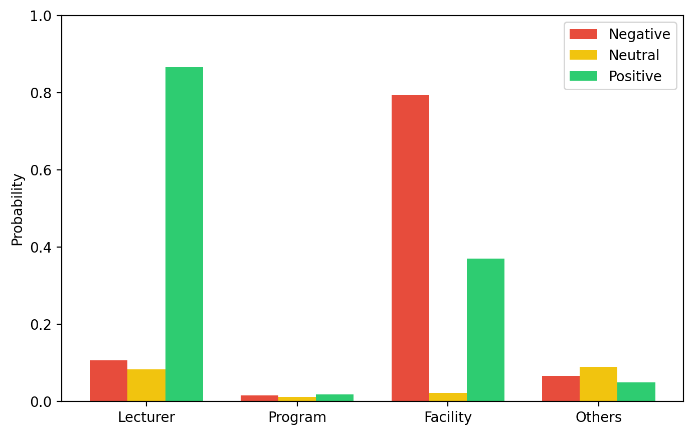
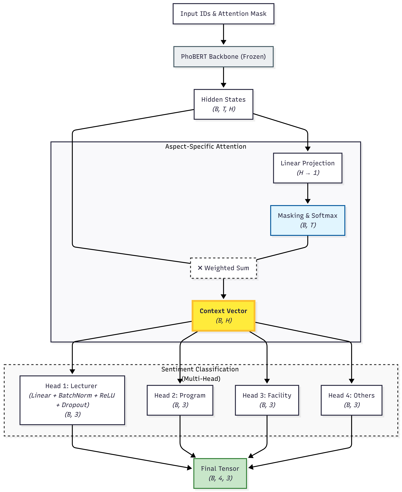
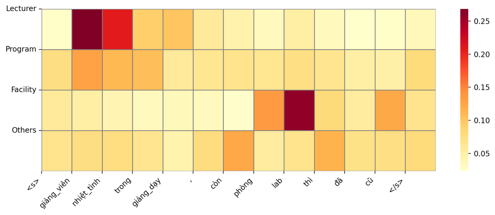
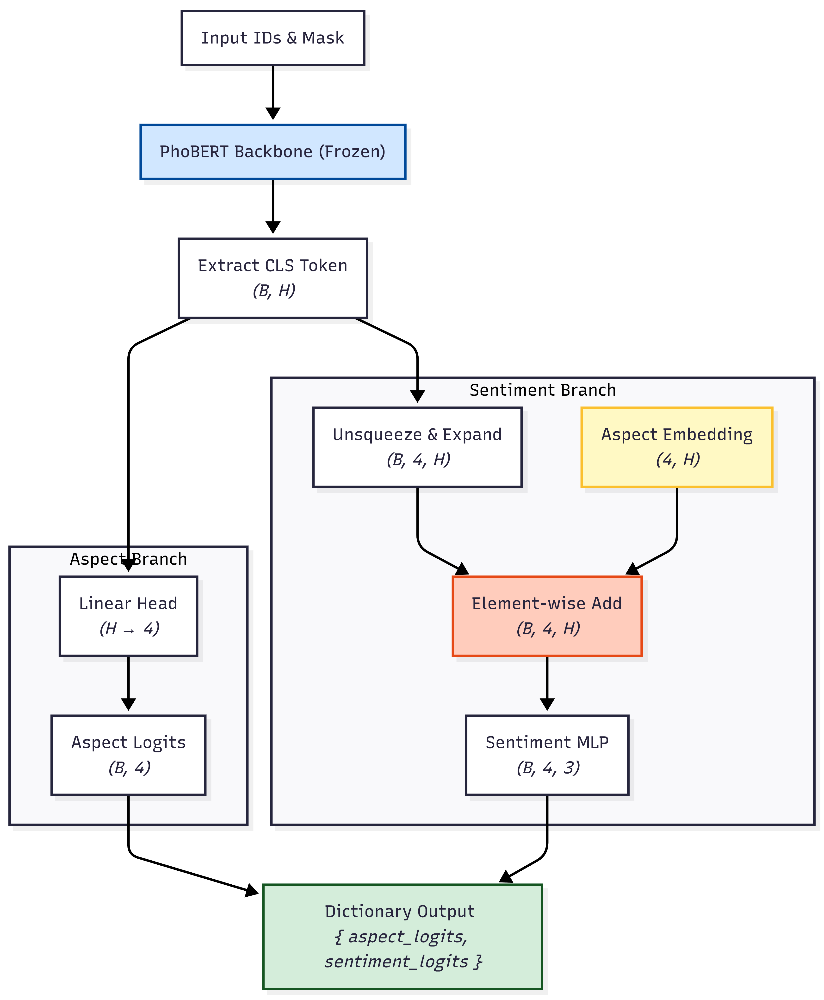

# Aspect-Based Sentiment Analysis (ABSA) for Student Feedback

This project performs Aspect-Based Sentiment Analysis (ABSA) to classify student feedback into 3 sentiments (**Positive**, **Neutral**, **Negative**) across 4 core aspects: **Lecturer**, **Training Program**, **Facility**, and **Others**.

The model is trained on the **UIT-VSFC** dataset ([Hugging Face Link](https://huggingface.co/datasets/uitnlp/vietnamese_students_feedback)).

## Example
* **Input:** *"giảng viên nhiệt tình trong giảng dạy, còn phòng lab thì đã cũ"* (The lecturer is enthusiastic, but the lab is outdated)
* **Output:** 
  * `Lecturer`: Positive
  * `Facility`: Negative



---

## Quick Start

Follow these steps to set up and run the Streamlit demo locally:

### 1. Clone the Repository & Install Dependencies
This project uses `uv` for fast dependency management.
```bash
git clone https://github.com/phucnguyenhoank/absa-train.git
cd absa-train
uv sync
```

### 2. Download the Model
* Download the pre-trained model weights from [this link](https://drive.google.com/drive/folders/1Wb1pZZw4W2BvvKaAk39ycKSJSbAQHyVp?usp=drive_link).
* Place the downloaded file into the project root directory.

### 3. Run the Web App
```bash
streamlit run streamlit_app.py
```

---

## Model Architectures

The project explores two architectures for multi-aspect sentiment classification on Vietnamese student feedback using a frozen PhoBERT backbone.

### 1. Attention-Based Multi-Head Architecture

This architecture applies a shared attention mechanism over PhoBERT hidden states to extract a contextual representation for sentiment classification across 4 aspects: Lecturer, Training Program, Facility, and Others.



#### Attention Visualization

The visualization below demonstrates how the model assigns higher attention weights to sentiment-relevant tokens. For example, the tokens `giảng_viên`, `nhiệt_tình` receive stronger attention for the `Lecturer` aspect, while `lab`, `cũ` are emphasized for the `Facility` aspect.



---

### 2. Conditional-Aspect Architecture

This architecture conditions sentiment prediction on learned aspect embeddings. The CLS representation from PhoBERT is combined with each aspect embedding to generate aspect-specific sentiment representations before classification.


---

## Current Limitations

* **Aspect Limit:** Currently optimized to handle a maximum of 2 aspects per input sentence.
* **Overfitting:** The model experiences slight overfitting due to programmatic data augmentation, which was used to expand the original single-aspect, single-sentiment dataset.
